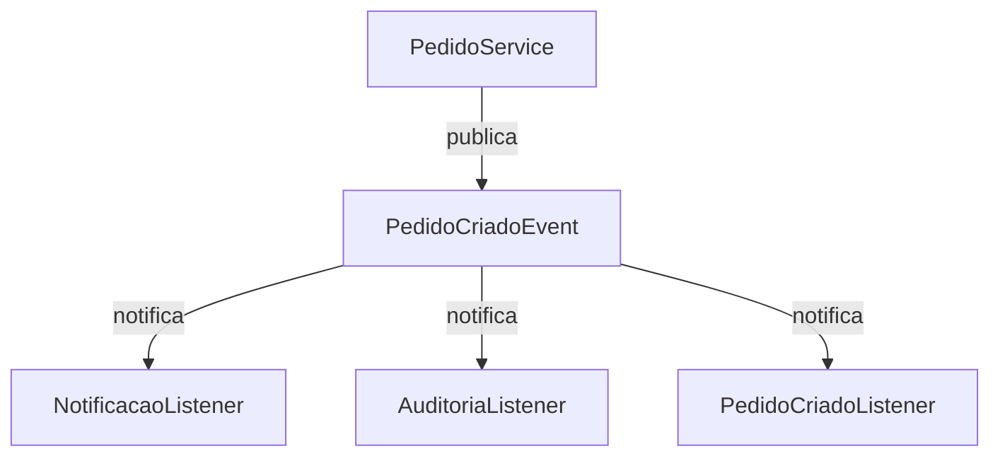
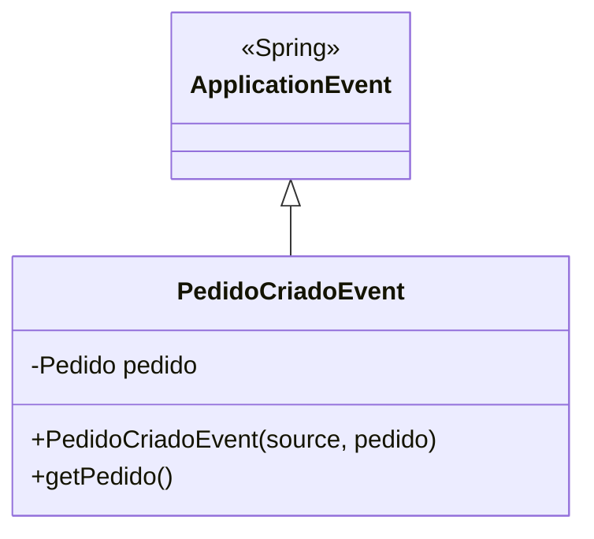
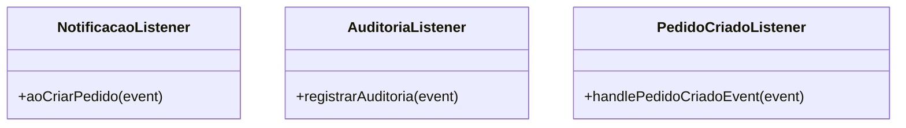
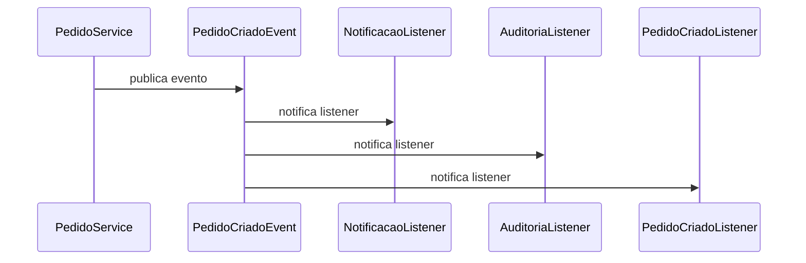

# POC Mediator Pattern com Spring Events e Resilience4j

Esta POC demonstra a implementação do padrão Mediator utilizando Spring Events para comunicação entre componentes e Resilience4j para tratamento de falhas com retry.

## Arquitetura



## Componentes Principais

### 1. Eventos


### 2. Listeners


## Fluxo de Execução



## Configuração do Retry

O Resilience4j está configurado com os seguintes parâmetros:

```yaml
resilience4j:
  retry:
    instances:
      pedidoListener:
        maxAttempts: 3
        waitDuration: 1s
        enableExponentialBackoff: true
        exponentialBackoffMultiplier: 2
```

- **maxAttempts**: 3 tentativas antes de falhar
- **waitDuration**: 1 segundo de espera entre tentativas
- **enableExponentialBackoff**: ativado para aumentar o tempo de espera
- **exponentialBackoffMultiplier**: multiplicador de 2 para o backoff exponencial

## Testes

A POC inclui testes unitários e de integração:

### Testes Unitários
- `PedidoCriadoEventListenerTest`: testa o comportamento do listener
  - Testa processamento com sucesso
  - Testa comportamento do retry em caso de falha

### Testes de Integração
- `PedidoCriadoEventListenerIntegrationTest`: testa a integração com Spring e Resilience4j
  - Verifica se o retry está funcionando corretamente
  - Confirma que o contador de execuções está correto

## Como Executar

1. Clone o repositório
2. Execute os testes:
```bash
./mvnw test
```

## Tecnologias Utilizadas

- Java 17
- Spring Boot
- Spring Events
- Resilience4j
- JUnit 5
- Mockito

## Benefícios da Implementação

1. **Desacoplamento**: Os componentes se comunicam através de eventos, reduzindo o acoplamento
2. **Resiliência**: O mecanismo de retry garante maior robustez em caso de falhas temporárias
3. **Manutenibilidade**: Código organizado e testável
4. **Escalabilidade**: Fácil adicionar novos listeners para diferentes eventos 